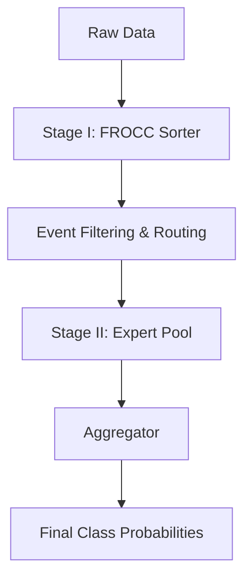

# Mixture of Experts for Multiclass Classification in Particle Physics

A dynamic two-stage Mixture-of-Experts (MoE) inference pipeline for High-Energy Physics (LHC) event classification.

---

## Pipeline Overview





## `train_and_tune_sorter.py`
This handles the entire lifecycle of the Sorter:

Loads Data from CSVs.

- Trains the `FROCC` model on pure background.
- Tunes the threshold automatically to guarantee your desired Signal Recall (e.g., 99.5%).
- Saves both the model weights and the calibrated threshold configuration.
- uses pipelines and scales before foing anything 


## `verify_sorter.py`
This verifies the sorter and runs over few examples to see if max. signals are passing to experts or not

## `src/base.py`
 The Contract." Contains Abstract Base Classes (`BaseSorter`, `BaseExpert`) to ensure any future signal model strictly adheres to the pipeline's input/output requirements.
## `src/experts.py`
Defines the PyTorch MLP architecture. Crucially, it outputs raw, unnormalized logits instead of probabilities, enabling post-training calibration.

## `train_expert.py`
Trains a single expert on a specific signal vs. background in strict isolation. It also calculates the optimal Temperature Scaling factor via LBFGS optimization to calibrate the model before saving it as a `.pt` file.


## 🚀 How to Run the Pipeline

Follow these steps in order to train and evaluate the complete system from scratch.

### Step 1: Train the Sorter (Stage I)
Train the anomaly detector to filter the QCD background.
```bash
python train_and_tune_sorter.py
```

### Step 2: Train experts (Stage II)
Train Expert 1 
```bash
python train_expert.py --signal_name "Tau_signal" --bg_csv "data/raw/background_train.csv" --sig_csv "data/raw/signalA_train.csv"
```

 Train Expert 2 
```bash 
python train_expert.py --signal_name "Signal_B" --bg_csv "data/raw/background_train.csv" --sig_csv "data/raw/signalB_train.csv"
```