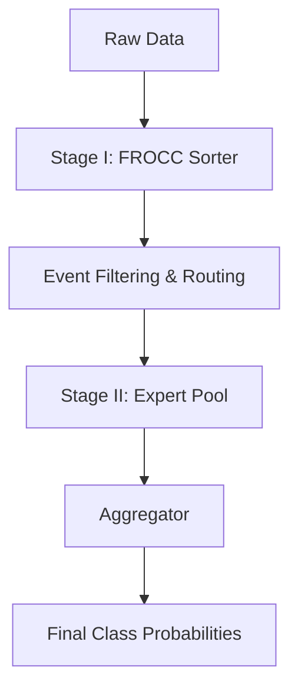

# Mixture of Experts for Multiclass Classification in Particle Physics

A dynamic two-stage Mixture-of-Experts (MoE) inference pipeline for High-Energy Physics (LHC) event classification.

---

## Pipeline Overview

## `train_and_tune_sorter.py`
This handles the entire lifecycle of the Sorter:

Loads Data from CSVs.

- Trains the `FROCC` model on pure background.
- Tunes the threshold automatically to guarantee your desired Signal Recall (e.g., 99.5%).
- Saves both the model weights and the calibrated threshold configuration.
- uses pipelines and scales before foing anything 

## `verify_sorter.py`
This verifies the sorter and runs over few examples to see if max. signals are passing to experts or not