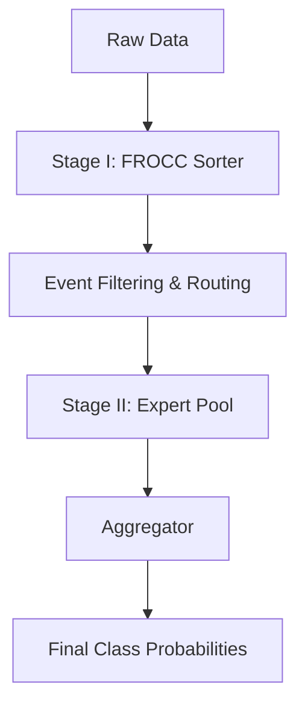

# Mixture of Experts for Multiclass Classification in Particle Physics

A dynamic two-stage Mixture-of-Experts (MoE) inference pipeline for High-Energy Physics (LHC) event classification.

---

## Pipeline Overview

